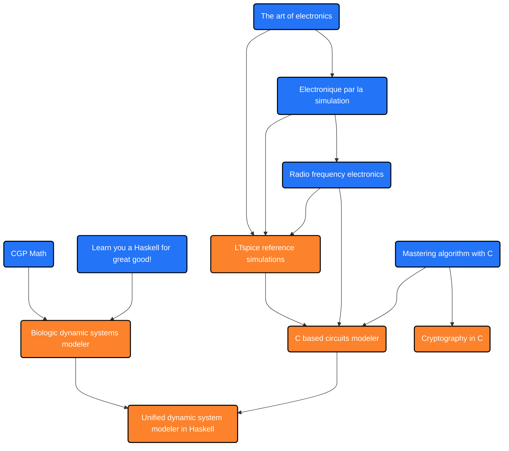

## :technologist: Summary 

An R&D engineer with a taste for science. My science exploring repository is [42](https://github.com/nimisbert/42).
[HW](https://github.com/nimisbert/42/tree/main/HW) is for electronics related topics, i.e. Kicad and LTspice. 
[SW](https://github.com/nimisbert/42/tree/main/SW) is for programming languages related topics, i.e. C and Haskell.

## :books: Books

-  Loudon Kyle, _Mastering algorithm with C_, __O'REILLY__, April 2002 
-  Mecklenburg Robert, _Managing Projects with GNU Make_, __O'REILLY__, November 2004
-  Lipovača Miran, _Learn You a Haskell for Great Good!_, __No Starch Press__, 2011
-  B. Mark, _64-bit assembly programming for Linux_, __Sharanych Media__, 2020
-  P. Horowitz & W. Hill, _The Art of Electronics_, __Cambridge University Press__, 2015
-  S. Dusausay, _L'Electronique par la simulation_, 2023
-  Jon B. Hagen, _Radio Frequency Electronics_, __Cambridge University Press__, 2009

## :computer: Projects

-  Cryptography Algorithms in C
-  Biologic dynamic systems modeler in Haskell
-  Electronic circuits modeler in C
-  Unified systems modeler in Haskell

## :chart_with_upwards_trend: Roadmap

